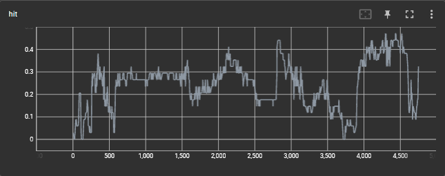

# Seminar paper project

This project contains my implementation and repoducability efforts of [Multiobjective Evaluation of Reinforcement Learning Based Recommender Systems](https://dl.acm.org/doi/10.1145/3523227.3551485)

## how to use
- all hyper-parameters are listed at the top of [main.py](https://github.com/dlay/seminar-project/blob/main/main.py).
- To execute and train the model, setup a python 3.9 environment with all packages installed, that are listed in the [requirements.txt](https://github.com/dlay/seminar-project/blob/main/requirements.txt).
- Then run:
```bash
python main.py
```
- HitRate@10 and nDCG@10 will be tracked while training for a single fixed user and can be seen in tensorboard by running:
```bash
tensorboard --logsdir=logs
```

### Example results
HitRate@10 over episodes in training:
</br>